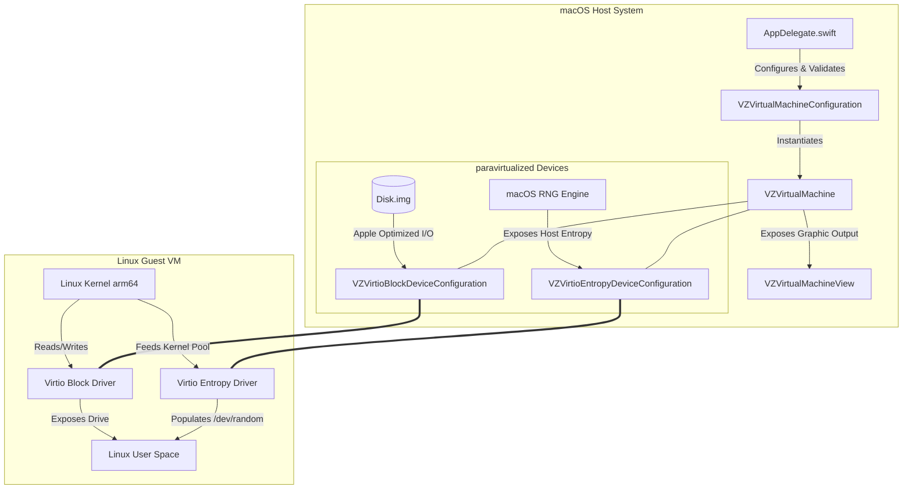

# Appleseed Linux

A native, lightweight, and paravirtualized macOS application developed by **Bengin Sternas** that runs high-performance GUI Linux virtual machines on Apple Silicon Macs using Apple's native **Virtualization** framework (`VZVirtualMachine`). 

Highly optimized for peak stability, scheduling efficiency, and a robust, crash-free launch experience.

---

## Preview

*Typical VM startup using `ubuntu-26.04-desktop-arm64.iso`.*

---

## Features

*   **Ultra-Stable & Highly Compatible**: Reverts hardware, disk, and graphics configurations to Apple's highly optimized, standard paravirtualized defaults. This prevents APFS write-back latency issues and driver indexing hangs.
*   **Intelligent Programmatic Display Fallback**: Features a dynamic view lookup. If the view outlet is not connected in the storyboard, the app dynamically locates the main window and injects the `VZVirtualMachineView` into the window's view hierarchy at launch. This prevents common storyboard/nib launch crashes.
*   **Hardware-Backed Entropy Device**: Configures a native paravirtualized `VZVirtioEntropyDeviceConfiguration` to feed macOS host-level entropy directly into the guest OS's `/dev/random` pool. This completely eliminates entropy starvation (a common issue in headless or GUI VMs), ensuring that cryptography-dependent services, system daemons, and apps launch instantly without the typical ~1-minute delay.
*   **Optimal CPU Scheduling**: Allocates `totalHostCores - 1` to the guest, maximizing single-VM scheduling efficiency on Apple Silicon chips without causing context-switching storms on the macOS host.
*   **Resource-Friendly Graphics**: Uses the lightweight **`1280 x 720`** scanout resolution. Because Linux guest GUI environments (like GNOME/GTK4) run on software rendering (`llvmpipe` on CPU) when no GPU is present, this lightweight layout prevents CPU bottlenecks and ensures System Settings and applications load instantly.
*   **Graceful ACPI Shutdown**: Hooks into the macOS application termination lifecycle (`applicationShouldTerminate`). When you close the window or quit the app (e.g., via Cmd+Q), the app automatically sends an ACPI power button signal to the guest, allowing the Linux OS to safely unmount all drives and shut down cleanly before the macOS process terminates. This completely protects the guest filesystem from corruption.
*   **Tidy Filesystem Footprint**: Keeps your Mac's home directory pristine by organizing all VM resources (disks, state, variable stores, and NVRAM) inside a clean, unified directory: `~/Virtual Machines/GUI Linux VM.bundle/`.

---

## Architecture

### Components

*   **`AppDelegate.swift`**: The central controller orchestrating VM lifecycle, hardware configuration, and the dynamic window view mapping fallback.
*   **`Linux.entitlements`**: Standard macOS security entitlements enabling hypervisor and virtualization capabilities at runtime.
*   **`Main.storyboard`**: Native Cocoa window interface displaying the VM.
*   **`ViewController.swift`**: View controller backing the Cocoa interface.

---

## Quick Start

### Prerequisites
*   An Apple Silicon Mac (M1, M2, M3, M4, etc.)
*   macOS 14.0 or newer
*   Xcode 15 or newer
*   An ARM64 Linux installer ISO image (e.g., `ubuntu-26.04-desktop-arm64.iso`)

### Step 1: Open the Project
Double-click `Linux.xcodeproj` to open the project in Xcode.

### Step 2: Build and Run
1. Press **`Cmd + R`** (or click the **Play** button in the top-left of Xcode) to build and run the application.
2. If this is a fresh setup, the app will automatically prompt you to select an installer ISO. Select your `ubuntu-26.04-desktop-arm64.iso`.
3. Complete the standard Linux installation inside the window.

### Step 3: Run the VM
Once installation is complete, the guest OS will shut down or reboot, cleanly exiting the macOS app. Upon next launch, the application detects the existing virtual disk bundle and boots **directly into your installed Linux system** without requesting the ISO!

---

## Resetting the VM
To perform a complete reset and start a fresh installation:
1. Delete the directory: `~/Virtual Machines/GUI Linux VM.bundle/`
2. Run the Xcode project again. The app will detect the missing bundle and prompt you for the installer ISO to begin a fresh setup.

---

## Contributing & Development

Contributions are welcome! Whether you want to fix a bug, add a feature, or improve the documentation, feel free to open an Issue or submit a Pull Request.

### Commit Message Guidelines
This project strictly enforces **Conventional Commits**. Please ensure your commit messages follow this format:
* `feat(scope): ...` for new features (e.g., `feat(audio): implement background playback`)
* `fix(scope): ...` for bug fixes (e.g., `fix(gui): resolve window resizing layout crash`)
* `perf(scope): ...` for performance improvements (e.g., `perf(entropy): resolve application startup latency`)
* `docs: ...` for documentation changes
* `refactor(scope): ...` for code changes that neither fix a bug nor add a feature

### Development Setup
1. Fork the repository on GitHub.
2. Clone your fork locally: `git clone https://github.com/benginsternas/appleseed-linux-mac-vm.git`
3. Open `Linux.xcodeproj` in Xcode 15+ and ensure your active scheme is set to **Linux**.
